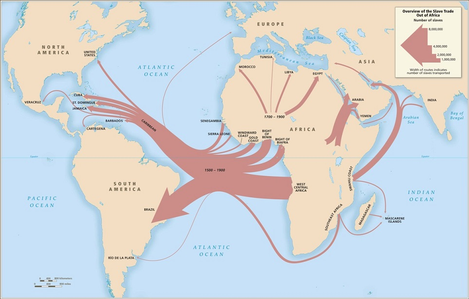
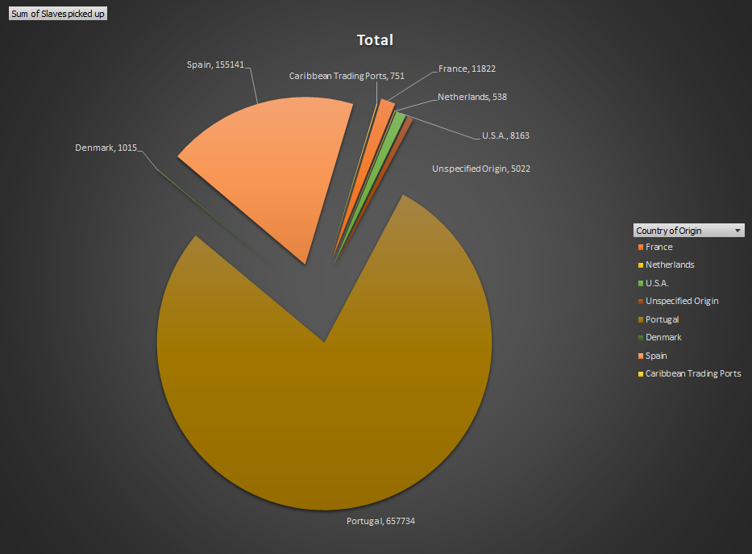
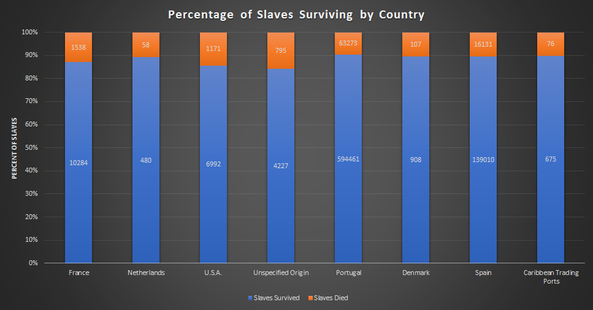

# Visualizations & Analysis

### The Trail Across the Waves

&nbsp;&nbsp;&nbsp;&nbsp;&nbsp;&nbsp; From this map created by the Trans-Atlantic Slave Database, we can see the movement of slaves from the interior of Africa to the New World. It is important to note that there was a good deal of transport from the Caribbean islands to the other countries that received slaves on this map. According to the data we gathered, roughly every one in four ships that docked at any of the islands contained slaves intended to be bought and owned by any of the islanders. The ports were mostly used as an inbetween point.

&nbsp;&nbsp;&nbsp;&nbsp;&nbsp;&nbsp; Here we have some of the results of our scrape put into a visual form. We can see the massive amount of slaves captured and exported by Portugal during the 19th century, and have a visual comparison to the exports of other countries. When looked at in conjunction to the map above, we can plainly see that the slaves are being exported mostly to the Portuguese colony of Brazil to drive agriculture forward.  

---

### Mortality Rates

&nbsp;&nbsp;&nbsp;&nbsp;&nbsp;&nbsp;Here we see the aggregate amount of slaves picked up vs the amount that survived. Going solely off the percentage, we see that each country was fairly efficient in their transport.

---

### Implications of Future Research
&nbsp;&nbsp;&nbsp;&nbsp;&nbsp;&nbsp;Given this information, and the ability to scan a broader area, an interesting direction to take this for future consideration would be to examine agricultural records and stack the output of a country pre-slavery to the output with slaves. From there, if possible, being able to then examine, say, American agricultural output post emancipation and see the impact of it on economics would be fascinating.
