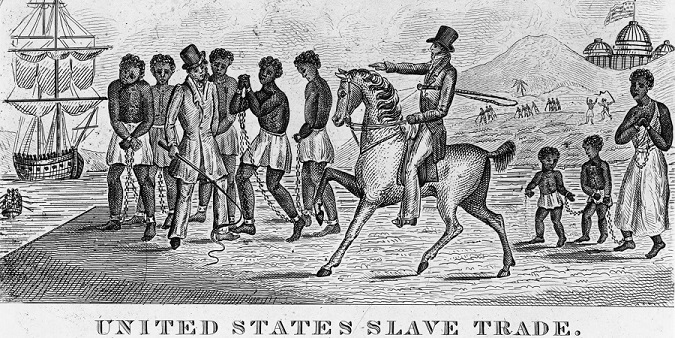

# Tracking the exploitation of a people

&nbsp;&nbsp;&nbsp;&nbsp;&nbsp;&nbsp;Regardless of what culture or region of the world one studies, they encounter the forced bondage of a different group of people at some point in their respective history. Whether it be the enslavement of those defeated in war, the enslavement of cultures deemed "sub-human", or the metaphorical slavery of wages, there is always evidence of duress in the history of a country. Whether it be the impetus for the birth of their nation, or the downfall of their country.

&nbsp;&nbsp;&nbsp;&nbsp;&nbsp;&nbsp;The slavery covered here is focused entirely on the oppression of blacks that still echoes through our nation to this day. The systematic enslavement and repression of these peoples bore scars that would continue to bleed throughout the genesis of our country. Whether it be the denial of their rights as a human, or the rejection of their contribution to society. Even today, with rights being "equal", we find that things truly are anything but.

&nbsp;&nbsp;&nbsp;&nbsp;&nbsp;&nbsp;The ultimate goal of this project is to lend credence to the fact that, while most European cultures have a background, a proud history, and a homeland, descendants of slaves are denied those things due to the nature of their heritage. The son of a slave most likely has no clue where in Africa they hail from, their ancestry, or their history. They are in America, and must continue on armed only with that knowledge. Their heritage is rooted here, in the country they bleed and work for, and it is this very same country that denies them those roots day by day.
